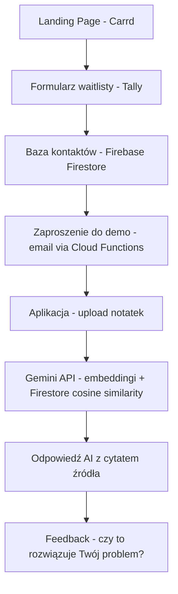

# Product Requirements Document

**Second Brain dla Freelancerów**
*v1.3 · MVP · Solo Founder*

---

## 1. Overview

| Pole | Wartość |
|---|---|
| Feature / Project Name | Second Brain dla Freelancerów |
| Owner | Solo Founder (Mirosław) |
| Wersja | v1.3 — MVP (przywrócony Firestore cosine similarity) |
| Cel wydania | Walidacja problemu i gotowości do płacenia za produkt |
| Platforma | Web (Next.js) + No-code (Glide/Carrd — Etap 1) |
| Status | In Progress — Etap: HOW |
| Data startu | Tydzień 1 (Sprint MVP) |
| Planowany launch | 7 dni od startu |

---

## 2. Problem Statement

Freelancerzy obsługujący wielu klientów jednocześnie tracą kontekst między projektami. Ustalenia, wyceny i historia rozmów są rozproszone po mailach, plikach i notatkach — bez jednego miejsca, gdzie można to wszystko szybko znaleźć.

> *„Gdzie ja to zapisałem... chyba w jakimś mailu z marca..." — typowy freelancer traci 30+ minut dziennie na szukanie informacji, które powinien mieć pod ręką.*

Istniejące narzędzia nie rozwiązują tego problemu w pełni:

- **Notion** — zbyt rozbudowany, wymaga dużo konfiguracji i nawyków
- **ChatGPT** — ogólny, nie zna kontekstu konkretnych projektów użytkownika
- **Gmail / Drive** — bałagan, brak struktury, brak inteligentnego wyszukiwania

---

## 3. Solution

Second Brain to aplikacja webowa oparta na AI, która działa jak osobisty asystent pamięci dla freelancerów. Użytkownik wgrywa swoje dokumenty — notatki, wyceny, ustalenia z klientami — i może z nimi rozmawiać przez prosty chat w języku naturalnym.

| PRZED | PO |
|---|---|
| Freelancer przekopuje stare maile przez 30 minut szukając ustaleń z klientem. | Pyta „Co ustaliliśmy z klientem X w marcu?" i dostaje konkretną odpowiedź w 3 sekundy. |

*Technologia: RAG (Retrieval-Augmented Generation) — AI odpowiada wyłącznie na podstawie dokumentów użytkownika, każda odpowiedź zawiera źródło dokumentu.*

---

## 4. User Stories

### Podstawowe (MVP)

- Jako freelancer, chcę wkleić lub wgrać notatki z projektu, aby mieć je w jednym miejscu dostępnym przez AI.
- Jako freelancer, chcę zapytać „Co ustaliliśmy z klientem X?", aby uzyskać odpowiedź w kilka sekund bez przeszukiwania maili.
- Jako freelancer, chcę widzieć z jakiego dokumentu pochodzi odpowiedź AI, aby móc ją zweryfikować.
- Jako nowy użytkownik, chcę zarejestrować się bez karty kredytowej i przetestować narzędzie przez 7 dni, aby ocenić jego wartość przed zakupem.

### Rozszerzone (po MVP)

- Jako freelancer, chcę wgrywać pliki PDF i dokumenty Word, aby nie musieć ręcznie kopiować treści.
- Jako freelancer Pro, chcę zintegrować narzędzie z moim mailem i Notion, aby baza wiedzy aktualizowała się automatycznie.

---

## 5. Scope

### ✅ Must-Haves (MVP)

- Landing page z opisem problemu i formularzem zapisu na waitlistę (Carrd + Tally)
- Prosta aplikacja: wklejanie notatek i dokumentów tekstowych
- Chat z własną bazą wiedzy (Google AI Studio / Gemini API)
- Odpowiedź AI z informacją o źródle dokumentu
- Ręczne zapraszanie pierwszych 5 użytkowników
- Free Trial 7 dni bez karty kredytowej

### ❌ Out of Scope (po MVP)

- Automatyczne indeksowanie i embeddingi (pełny RAG z wektorową bazą danych)
- Upload PDF i plików binarnych — na start tylko tekst wklejany ręcznie
- Integracje z mailem, Notion, Google Drive
- Aplikacja mobilna
- Dashboard analityczny i wersjonowanie dokumentów
- Plan Pro ($39/msc) z nielimitowanymi dokumentami

---

## 6. User Flow

---

## 7. Tech Notes

### Etap 1 — No-Code (walidacja, 5–7 dni)

| Potrzeba | Narzędzie | Uwagi |
|---|---|---|
| Landing Page | Carrd.co | Gotowy w 1 godzinę |
| Formularz waitlisty | Tally.so | Łączy się z Firebase przez Make |
| Baza kontaktów | Firebase Firestore | ✅ Od razu w docelowej bazie — brak późniejszej migracji z Airtable |
| Aplikacja dla użytkowników | Glide (prototyp) | Szybki prototyp UI, zastąpiony przez Next.js w Etapie 2 |
| Logika AI / Q&A | Google AI Studio | Prototypowanie promptów — ten sam ekosystem co Gemini API |
| Automatyzacje (przejściowo) | Make (Integromat) | Tylko na Etapie 1 — zastąpiony przez Cloud Functions w Etapie 2 |
| Płatności | Stripe Payment Link | Bez integracji — link do płatności |

> ⚠️ **Kluczowa zmiana vs. poprzedni plan:** Airtable zastąpiony przez Firebase Firestore już w Etapie 1. Dzięki temu dane użytkowników (waitlista, kontakty) nie wymagają migracji przy przejściu do Etapu 2.

### Etap 2 — Docelowy Stack (Next.js, po walidacji)

| Warstwa | Technologia | Uzasadnienie |
|---|---|---|
| Frontend | Next.js 14 (App Router) | Hosting: Vercel — SSR + API routes w jednym repo |
| Autentykacja | Firebase Auth | Email + Google OAuth |
| Baza danych | Firebase Firestore | Dokumenty użytkownika + metadane |
| Storage | Firebase Storage | Pliki użytkownika (PDF, txt, docx) |
| AI — Embeddingi | Gemini API (text-embedding-004) | Wektoryzacja dokumentów |
| AI — Odpowiedzi | Gemini API (gemini-1.5-flash) | Q&A na bazie RAG |
| Wyszukiwanie wektorowe | Firestore + cosine similarity (Next.js API Route) | ✅ Wystarczające przy limicie 50 doc/user (~500–1000 chunków). Próg migracji: > 2000 chunków LUB latencja > 500ms → wtedy Pinecone / pgvector |
| Automatyzacje / Backend | **Firebase Cloud Functions** | ✅ Zastępuje Make z Etapu 1 — triggery, emaile powitalne, logika onboardingu |
| Płatności | Stripe (full SDK) | Upgrade ze Stripe Payment Link po walidacji |

### Mapa spójności stacku (Etap 1 → Etap 2)

| Element | Etap 1 (No-Code) | Etap 2 (Next.js) | Migracja |
|---|---|---|---|
| Baza danych | Firebase Firestore | Firebase Firestore | ✅ Brak — ten sam system |
| AI / LLM | Google AI Studio | Gemini API | ✅ Ten sam model, inny interfejs |
| Wyszukiwanie wektorowe | Brak (tekst w prompcie) | Firestore + cosine similarity | ✅ Nowa warstwa, dane już w Firestore — bez migracji bazy |
| Automatyzacje | Make (Integromat) | Firebase Cloud Functions | ⚠️ Przepisanie logiki (jednorazowe) |
| Frontend | Glide | Next.js | ⚠️ Pełne przepisanie UI (zaplanowane) |
| Płatności | Stripe Payment Link | Stripe SDK | ✅ Upgrade, dane klientów zostają |

### Ryzyka i ograniczenia

- **Cosine similarity limit** — przy > 2000 chunków per user latencja przekroczy 500ms; wtedy migracja do Pinecone lub pgvector (1–2 dni pracy)
- **Glide nie obsługuje RAG** — na Etapie 1 wystarczy prompt + wklejony tekst, RAG wchodzi w Etapie 2
- **Firebase Cloud Functions cold start** — przy małym ruchu pierwsze wywołanie może być wolne; rozważ keep-alive dla kluczowych funkcji
- **Limit dokumentów Firestore** — monitoruj koszty odczytów przy wzroście liczby użytkowników

---

## 8. Success Metrics

| Metryka | Cel | Deadline |
|---|---|---|
| Maile na waitliście przed buildem | 20+ maili | Dzień 2 |
| Aktywni użytkownicy testujący MVP | 5 freelancerów | Dzień 6–7 |
| Regularne używanie przez 2 tygodnie | Min. 5 osób | Tydzień 2–3 |
| Deklaracja gotowości do płacenia | „Zapłaciłbym $15–20/msc" | Min. 2 osoby |
| Płatny użytkownik przed końcem miesiąca | 1 konwersja | Miesiąc 1 |
| Rozmowy walidacyjne z freelancerami | Min. 3 rozmowy | Dzień 7 |

---

## 9. Timeline

| Dzień | Zadanie | Cel | Narzędzie |
|---|---|---|---|
| Dzień 1 | Landing page + formularz waitlisty | Strona online, zbieramy maile do Firestore | Carrd + Tally + Firebase |
| Dzień 2 | Post na Reddit + LinkedIn + cold outreach | 20 maili na liście przed budowaniem | Ręcznie |
| Dzień 3 | Prosta appka Glide + baza w Firestore | Działający prototyp appki | Glide + Firebase |
| Dzień 4 | Integracja Google AI Studio z Glide | Można zadać pytanie i dostać odpowiedź | AI Studio + Make |
| Dzień 5 | Testy na własnych danych, poprawki UX | Produkt działa bez wiedzy technicznej | Glide |
| Dzień 6 | 5 osób z waitlisty dostaje dostęp | Pierwsze dane walidacyjne i feedback | Email ręczny |
| Dzień 7 | Rozmowy z użytkownikami, decyzja o kolejnym kroku | Walidacja lub pivot | Zoom/Meet |

---

## 10. Model Cenowy

| Plan | Cena | Zawartość | Cel |
|---|---|---|---|
| Free Trial | 0 zł / 7 dni | Pełny dostęp, bez karty kredytowej | Usuwa barierę wejścia |
| Solo | $19 / msc | Do 50 dokumentów, nielimitowany chat | Główny plan na MVP |
| Pro (później) | $39 / msc | Nielimitowane dokumenty + integracje | Gdy pojawi się popyt |

> *Zasada: jeden prosty plan na start. Nie komplikuj cen zanim nie wiesz, czego chcą klienci.*

---

## 11. Next Steps

| Priorytet | Akcja | Kiedy |
|---|---|---|
| 🔴 Dziś | Postaw Carrd z waitlistą zbierającą maile **do Firebase** (nie Airtable) — przed pisaniem kodu | Dzień 1 |
| 🟡 Ten tydzień | Zbierz 20 maili i przeprowadź 3 rozmowy z freelancerami — przed budowaniem | Dzień 1–2 |
| 🟢 Dzień 3–4 | Zbuduj prototyp w Glide + Google AI Studio po potwierdzeniu bólu rynkowego | Dzień 3–4 |
| 🟢 Dzień 5–6 | Daj dostęp 5 osobom z waitlisty za feedback gdy demo jest gotowe | Dzień 5–6 |
| 📊 Po launchu | Zbierz feedback i zdecyduj: budować dalej (Next.js + Firestore RAG) czy pivot? | Dzień 7+ |

> **Pamiętaj: MVP ma odpowiedzieć na jedno pytanie — czy ktoś za to zapłaci?**

---

