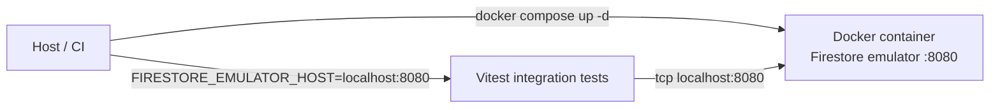

# ADR-016: Emulator Firestore w Dockerze

## Status

Proponowany

## Kontekst

Testy integracyjne wymagają emulatora Firestore. Port 8080; `lib/firebase-admin.ts` obsługuje tryb emulator-only przy ustawionym `FIRESTORE_EMULATOR_HOST`. W CI i na maszynie deweloperskiej wygodnie uruchamiać emulator w kontenerze Docker (wymagany tylko Docker na hoście), bez dodatkowych narzędzi.

## Decyzja

Wprowadzamy **uruchomienie emulatora Firestore w kontenerze Docker** jako zalecany sposób (na hoście tylko Docker).

- **Plik konfiguracji:** osobny plik `docker-compose-test.yml` w katalogu głównym — odseparowanie od ewentualnego przyszłego `docker-compose.yml` aplikacji.
- **Obraz:** `ghcr.io/178inaba/firestore-emulator` (Firestore Native, port 8080, aktualizowany 2024).
- **Port:** 8080 mapowany na host; z perspektywy testów bez zmian — nadal `FIRESTORE_EMULATOR_HOST=localhost:8080`.
- **Healthcheck:** Oficjalny emulator nie definiuje GET health na 8080. W skryptach używamy **wait-on tcp:8080**; w docker-compose healthcheck pomijamy lub dodajemy tylko po weryfikacji zachowania obrazu.
- **Reguły:** Nie montujemy `firestore.rules` — testy integracyjne weryfikują logikę serwisów, nie reguły Firestore; emulator startuje z domyślnymi (otwartymi) regułami.
- **Projekt:** `FIREBASE_PROJECT_ID` / `GCLOUD_PROJECT` ustawiane na hoście (lub domyślne `demo-secondbrain` w firebase-admin); nie jest wymagane ustawianie w kontenerze.
- **Kod:** Żadnych zmian w testach ani w `lib/firebase-admin.ts`.

**Czyszczenie danych emulatora:** Ten sam endpoint działa z Dockerem: `DELETE http://HOST:8080/emulator/v1/projects/{project}/databases/(default)/documents`. W dokumentacji podajemy endpoint **parametrycznie** (projekt z `FIREBASE_PROJECT_ID`, fallback `demo-secondbrain`). Opcjonalnie wywołanie w beforeAll lub skrypcie przed testami.

**Znane ograniczenie:** Skrypt `test:integration:docker` (up -d → wait-on → testy → down) używa `&&`; przy błędzie testów (exit code 1) wykonanie przerywa się przed `down`, więc kontener pozostaje uruchomiony. Przy niepowodzeniu testów należy ręcznie wywołać `docker compose -f docker-compose-test.yml down`. Na CI runner jest zwykle efemeryczny; na maszynie dewelopera może to być uciążliwe. W przyszłości można rozważyć trap/finally lub skrypt zapewniający zawsze wykonanie `down`.

**Docker Compose:** Zakładamy **V2** (`docker compose`). W starszym środowisku w komendach użyj `docker-compose` zamiast `docker compose` (w dokumentacji jedna wzmianka).

## Opcje uruchomienia testów integracyjnych (podsumowanie)

| Opcja | Druga baza? | Docker? |
|-------|-------------|---------|
| Drugi projekt Firebase | tak (osobny projekt) | nie |
| Ten sam projekt, użytkownik testowy | nie | nie |
| **Emulator w Dockerze (zalecane)** | nie (emulator) | **tak** |

## Konsekwencje

**Pozytywne:**

- Uruchomienie testów integracyjnych z emulatorem wymaga tylko Docker na hoście.
- CI uruchamia testy przeciw emulatorowi w Dockerze bez dodatkowych narzędzi na runnerze.

**Negatywne:**

- Wymóg Docker na maszynie deweloperskiej i w CI.

**Zależności:**

- ADR-015 (sekcja 7a) — emulator w Dockerze jako zalecana testowa baza.
- Szczegóły procedury: [tests/integration/README.md](../../tests/integration/README.md).

## Wdrożenie (wynik decyzji)

- Plik `docker-compose-test.yml` — jedna usługa emulatora, port 8080.
- Skrypty w `package.json`: `emulator:docker` (up -d), `test:integration:docker` (pełny cykl: up -d → wait-on → testy → down).
- Sekcja „Emulator w Dockerze” w [tests/integration/README.md](../../tests/integration/README.md) i [tests/docs_tech/test_workflow.md](../../tests/docs_tech/test_workflow.md) z komendami dla Unix/Mac i PowerShell oraz znanym ograniczeniem (kontener przy błędzie testów).
- Wzmianka w ADR-015 (sekcja 7a).

